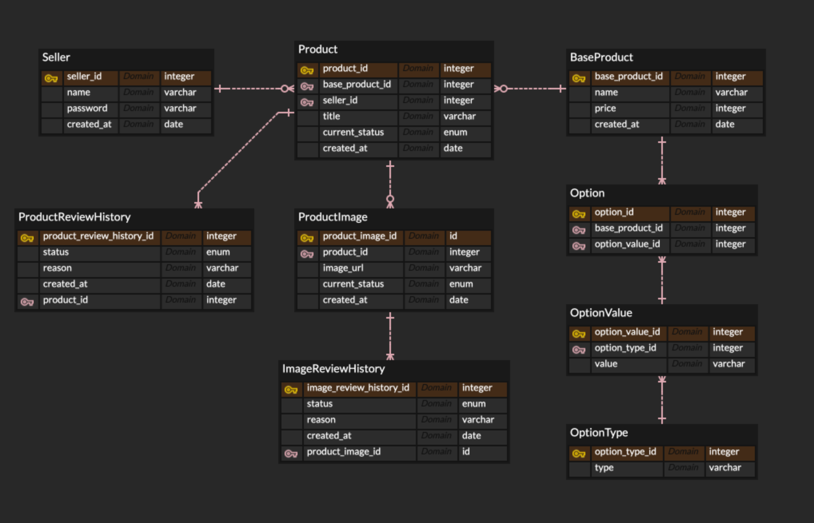

# BRS POD CRUD

### ERD

### API 요구사항 → 스프링 프로젝트를 통해 API 개발

> 앞서 설계한 ERD 기반으로 필요한 API 를 제공하기위해 @Controller 와 DTO 클래스 정의 및 개발 필요
> API 파라미터와 반환값에 대한 제약사항도 함께 요구사항으로 전달하니 꼼꼼히 읽고 개발할것

1. **아이디 / 패스워드 기반 로그인 API** = **BASIC 인증 설정만 하면되고 따로 개발하지 않는다**

2. **유저 회원가입 API**

   - 요청 : **아이디 + 패스워드**
   - 반환 : **가입이 완료된 유저정보를 할당된 ID 와 함께 반환한다**
   - 에러 : **기존에 가입된 유저 아이디와 같은 아이디를 입력받았다면 중복계정 존재 에러를 반환한다**
   - 에러 : **아이디와 패스워드에 대해 최소최대 길이에 대한 제약을 둔다**
     - 검증 : **아이디는 최소 5자여야하고, 최대 10자여야한다**
     - 검증 : **비밀번호는 최소 8자여야하고, 대문자와 소문자 각각 최소 1개는 포함되어있어야한다**

3. **사진 업로드를 통한 상품 생성 API**

   - 요청 : **베이스 제품 ID + 상품 이름 + 여러장의 사진** (최소 1장, 최대 5장)
   - 반환 : **등록이 완료된 상품 정보를 반환한다**
   - 에러 : **베이스 제품 ID 가 존재하지않는다면 존재하지 않는 베이스 제품 에러를 반환한다**
   - 에러 : **사진개수와 상품이름의 길이에 대한 제약을 둔다**
     - 검증 : **사진은 최소 1장이어야하고, 최대 5장이어야한다**
     - 검증 : **상품이름은 최대 20자여야한다**

4. **현재 로그인한 유저가 등록한 상품 조회 API**

   - 요청 : (없음)
     - **~~중요 : FORM 로그인 성공 후 그 로그인에 해당하는 유저정보** ← JSESSIONID~~ → 어려울 수 있어서
     - **중요 : BASIC 을 통해 API 호출할 수 있도록 한다** (매번 ID/PW 를 Base64 로 변환해서 전달)
   - 반환 : **현재 로그인한 유저가 등록한 상품 정보들을 반환한다** (승인 / 거절 / 금지 여부 모두 상관없이)
     - 만약 등록한 상품이 없다면 빈 배열을 반환하면된다
     - 각 상품마다 내부 리뷰과정 히스토리 과정을 모두 배열로 함께 반환해야한다
       - 예) 언제 승인되었고 언제 거절되었고 언제 금지되었고 언제 다시 승인되었는지 등의 정보
   - 에러 : **로그인한 유저가 없다면 현재 로그인되지 않았기에 로그인이 필요하다는 에러를 반환한다**

5. **등록된 모든 상품 조회 API**

   - 요청 : **사이즈 + 페이지** (페이지네이션)
     - 예) 사이즈 10개 / 3번째 페이지 = 21번째부터 30번째까지의 상품을 조회한다
   - 반환 : **다양한 판매자로부터 등록 후 성공적으로 승인받은 상품들의 정보만을 반환한다**
     - 등록 / 승인 / 거절 / 금지 4가지 상태 중 등록 상태인 상품만을 반환해야한다
     - 내부 리뷰과정 히스토리와 같은 민감한 정보는 출력할 필요가 없다 = 외부 유저가 보는것이기에

6. **등록된 상품에 대한 내부 리뷰 API**

   - 요청 : **상품 ID + 변경하고자 하는 상태**
   - 반환 : **변경된 상태의 상품 정보를 내부 리뷰과정 히스토리와 함께 반환한다**
   - 에러 : **상품 ID 가 존재하지않는다면 존재하지 않는 상품 에러를 반환한다**
   - 에러 : **상태가 변경될때에는 이전 상태가 과연 요청한 상태로 변경이 가능한것인지 확인이 필요하다**
     - **등록 / 거절 / 금지**일때만 > **승인**으로 변경 가능
     - **등록** 일때만 > **거절**으로 변경 가능
     - **승인** 일때만 > **금지**으로 변경 가능
